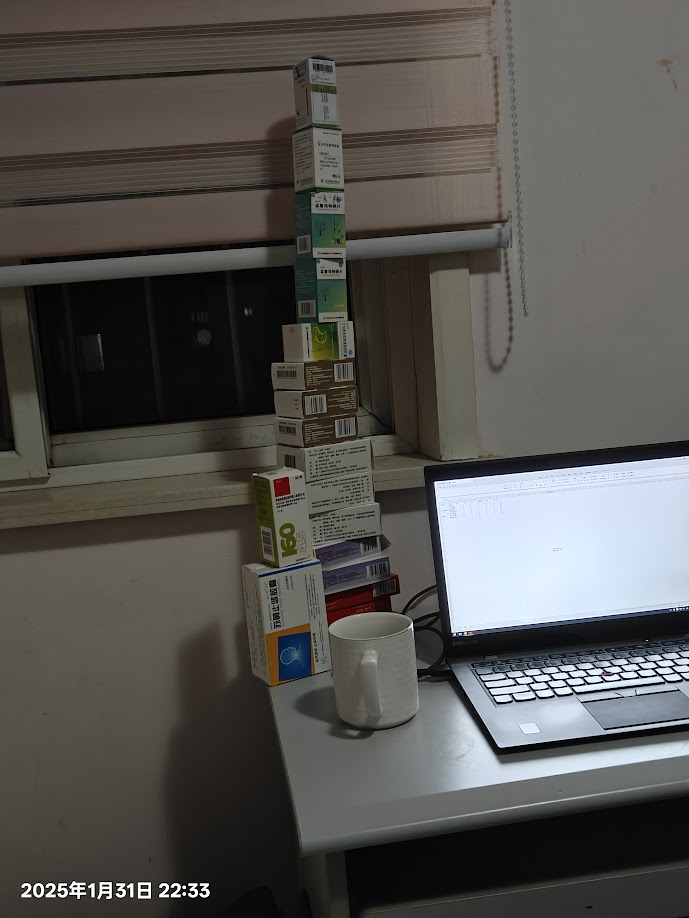
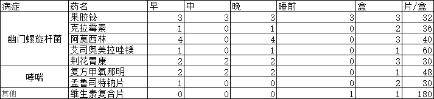

### 楔子

过年回家的时候，被我妈拉去县医院做了传染病四项检查，很遗憾，四项一项都没中，不过别担心，中了一个幽门螺旋杆菌，开了一点点药，吃完就没问题了。

### 正文

这让我想到了王东岳在《物演通论》对过度医疗和过度检查的看法，从进化论和逻辑自洽的角度来分析现代医学的问题。现代医学的发展虽然极大地延长了人类寿命，但也带来了某些过度医疗和过度检查的问题，结合此书，下面是我对此次过度医疗的一些看法：

1. 过度医疗的本质
    - 医疗系统的市场化和商业化导致医疗资源的过度使用，医生和医院在利益驱动下可能会推荐不必要的治疗。
    - 过度医疗可能使人类群体整体的适应性降低，因为许多被医学手段延续生命的人，可能在进化角度上是“被淘汰”的个体。
    - 现代医学的作用不一定是让人类更加健康，而是让人类“延长不健康状态”，即带病生存。

2. 过度检查的现象
    - 由于现代医疗技术的提高，各种检测手段层出不穷，导致许多亚健康或轻微异常的人被归为“病人”。
    - 许多检查并不能有效地提高个体的健康状况，反而可能导致“发现即治疗”的误区，进而催生不必要的医疗行为。
    - 现代医学的“精细化”趋势，导致越来越多的无症状人群接受筛查，产生焦虑感甚至过度干预。

当然，这些观点并不是完全否定现代医学，而是从更高维度的文明进化视角去探讨医疗系统的弊端。这些思考有助于我们更理性地看待医疗的发展方向，也提醒人们在面对医学建议时保持一定的思辨能力。

